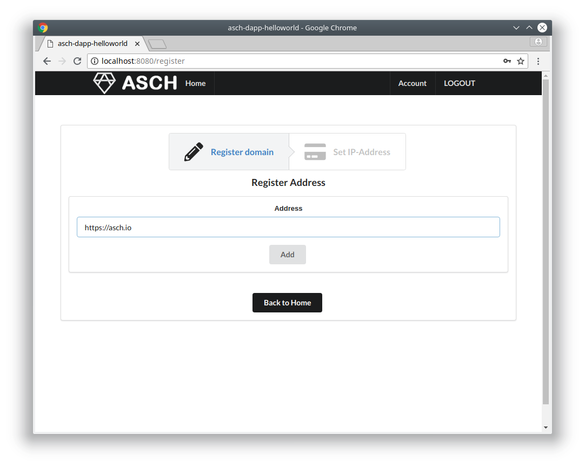
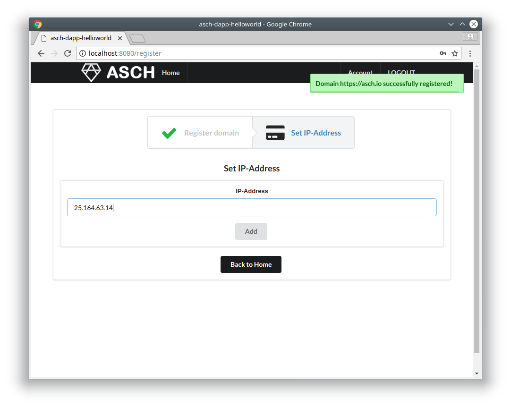
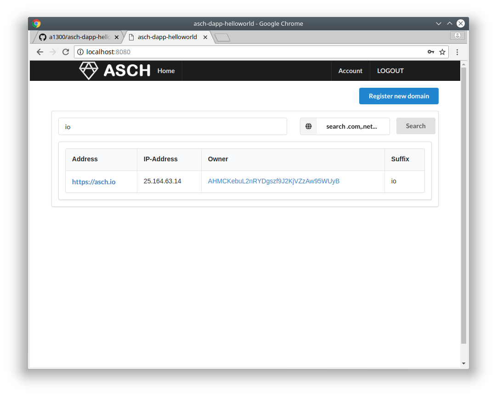
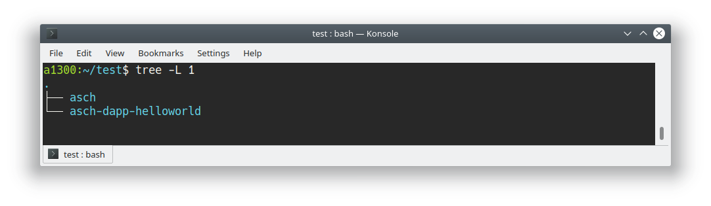
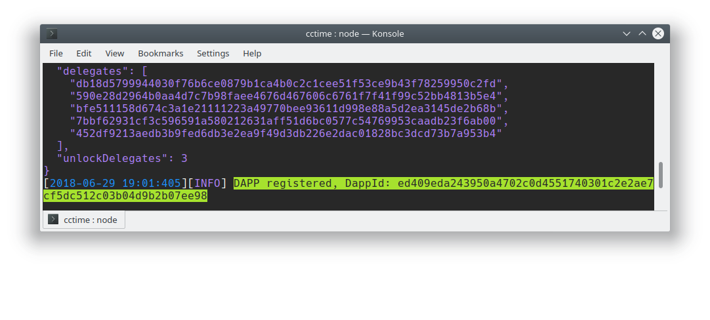
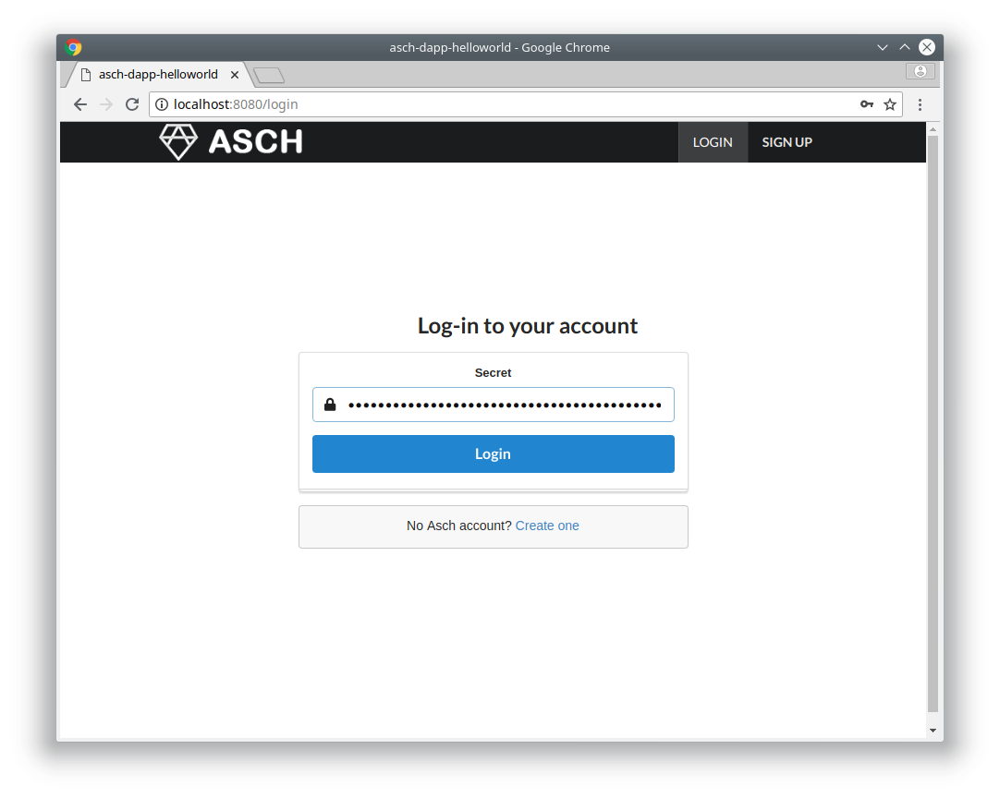
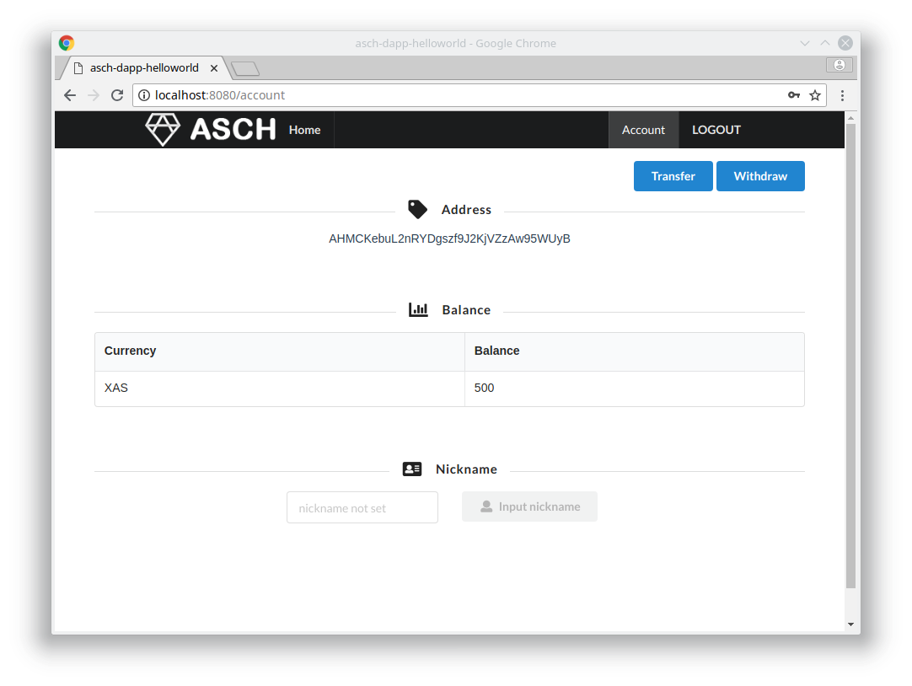

# Asch Dapp Helloworld

This repository is a simple __hello world__ Dapp (decentralized application). With this Dapp you can register domains and link IP-Addresses to them. Very much like a basic DNS system.  

## Important
__This repository__ includes the __Backend__ and the __Frontend__ of the `asch-dapp-helloworld`. We will learn how to install the backend and the frontend.  






# 1 Installation  

## 1.1 Preparation  

Please follow the following steps carefully, to register your `asch-dapp-helloworld` Dapp on your local Asch Blockchain.  

### 1.1.1 Clone asch-dapp-helloworld  

Clone __this__ repository:  

```bash
git clone https://github.com/aschplatform/asch-dapp-helloworld/
```

### 1.1.2 Install Asch Blockchain
If you haven't installed the Asch Blockchain, the installation instructions are located [here](https://medium.com/aschplatform/develop-blockchain-apps-with-sidechain-technology-part-1-c5aa91c4602f).

After the installation of the Asch Blockchain you should have the following file structure: 

  

<br />
<br />


## 1.2 Install Dapp Backend

In order to install your `asch-dapp-helloworld` Dapp, first install [asch-redeploy](https://github.com/aschplatform/asch-redeploy)

```bash
npm install --global asch-redeploy
```

Change directory:  
```bash
cd asch-dapp-helloworld
```

Then execute asch-redeploy in the `asch-dapp-helloworld` folder:
```bash
asch-redeploy --output development/src/dappConfig.json
```

After a few seconds the dapp should be successfully registered on the local Asch Blockchain:

__DappId__
> The new `<dapp Id>` for our Dapp is __ed409eda243950a4702c0d4551740301c2e2ae7cf5dc512c03b04d9b2b07ee98__  
> (yours will be different)



## 1.3 Install Dapp Frontend

In the `asch-dapp-helloworld/development` folder is the frontend for our Dapp.  
Change directory to the `development` folder.  

```bash
cd development
```

Install all dependencies:  

```bash
npm install
```

Start the webserver:  
```bash
npm run dev
```

## Use the Dapp

Open your favourite browser and type `http://localhost:8080`  

For this tutorial we use the following account:  
```json
{
  "secret": "sentence weasel match weather apple onion release keen lens deal fruit matrix",
  "publicKey": "a7cfd49d25ce247568d39b17fca221d9b2ff8402a9f6eb6346d2291a5c81374c",
  "address": "AHMCKebuL2nRYDgszf9J2KjVZzAw95WUyB",
}
```

Login with the `secret` we introduced right above:  


Your account:  

--------------

# Help
If something is not working for you post your problem on [gitter.im/asch-development](https://gitter.im/asch-development/Lobby).
